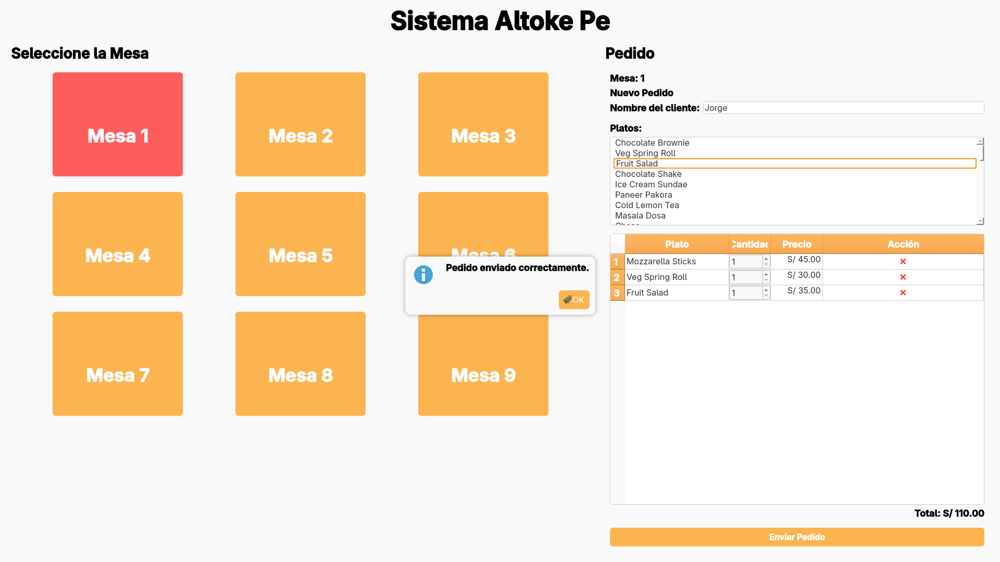
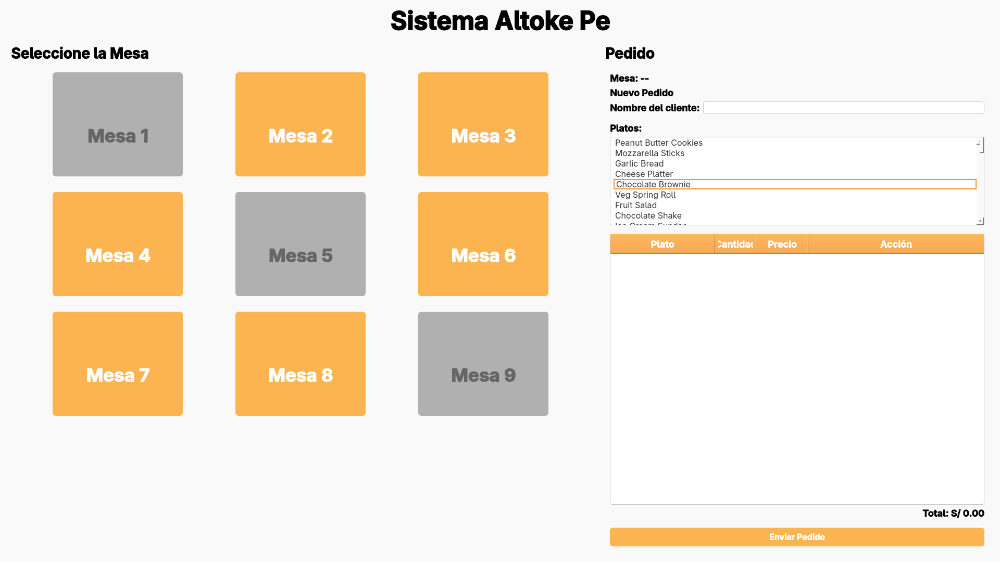
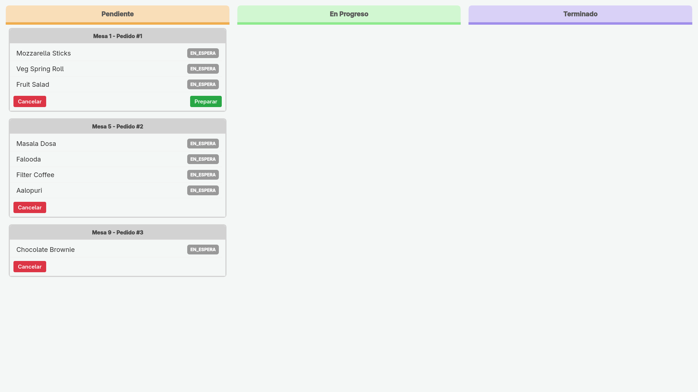
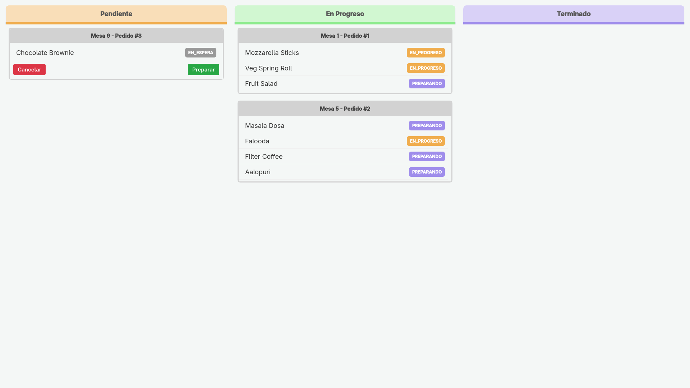
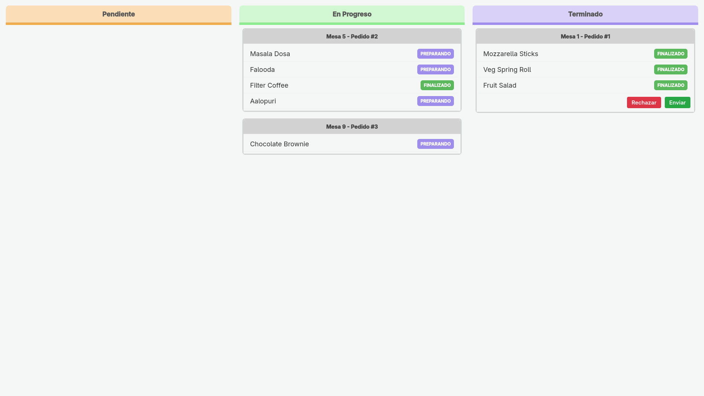
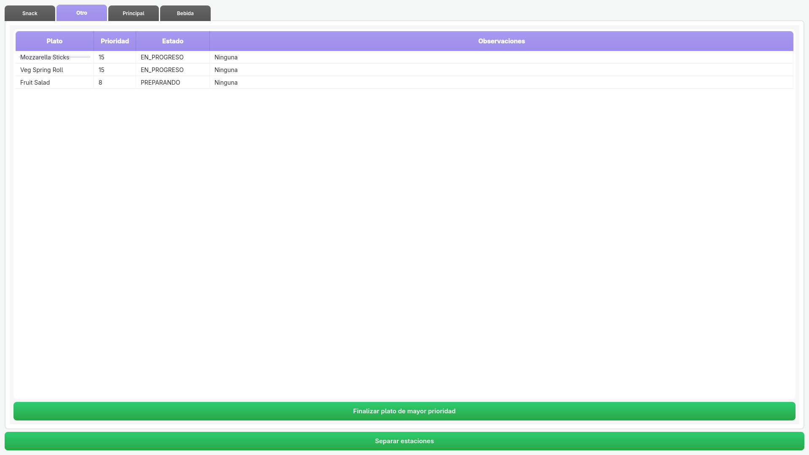
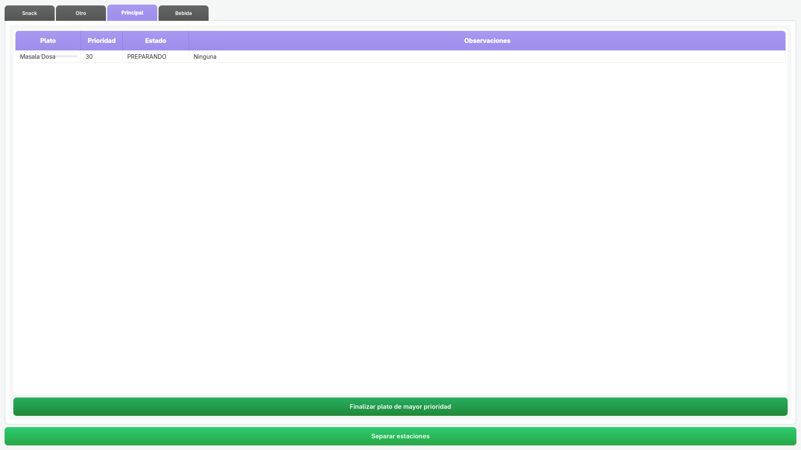
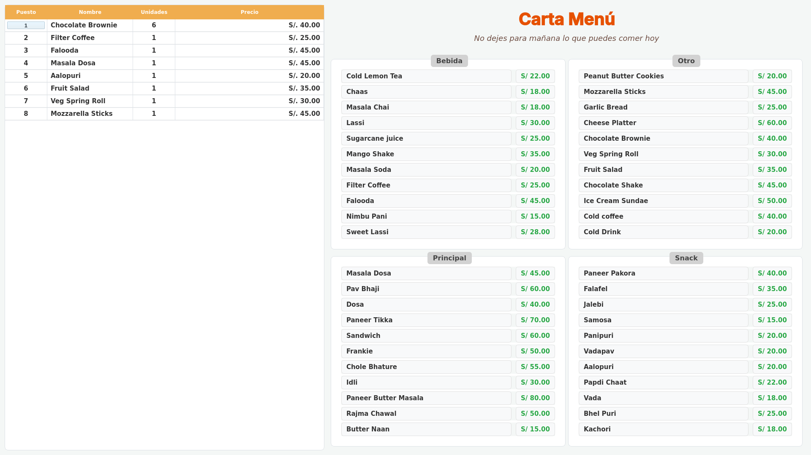

# Sistema Altokepe

## Descripción General
Sistema Altokepe es una plataforma integral para la gestión de pedidos en restaurantes, desarrollada bajo una arquitectura **cliente-servidor** utilizando comunicación **TCP/IP** e intercambio de datos en formato **JSON**.  
El sistema conecta los distintos módulos operativos del restaurante —recepcionista, estaciones de cocina y panel de ranking— con el fin de coordinar los pedidos y notificaciones en tiempo real.  
El proyecto busca optimizar los procesos de atención, reducir tiempos de espera y mejorar la trazabilidad de cada pedido desde su creación hasta su entrega.

El desarrollo se llevará a cabo bajo la **metodología ágil SCRUM**, mediante **cinco sprints semanales**. Cada sprint representa una iteración del producto, generando un incremento funcional y verificable. Este enfoque permitirá adaptar los entregables según la retroalimentación del equipo y los objetivos del proyecto.

---
## Video del Enlace
Link del viedo: https://www.youtube.com/watch?v=z2ad4dnb1Wg

---
## Integrantes
- Ajra Huacso Jeans Anthony -> dev-Anthony  
- Luque Condori Luis Guillermo -> dev-Luis  
- Garambel Marin Fernando Miguel -> dev-Fernando  
- Jorge Luis Mamani Huarsaya -> dev-Jorge  
- Sergio Danilo Hancco Mullisaca -> dev-Sergio
- Dolly Yadhira Mollo Chuquicaña -> dev-Dolly
- Suclle Suca, Michael Benjamin -> dev-Michael

---

## Objetivos

### Objetivo General
Desarrollar un sistema distribuido de gestión de pedidos que integre los módulos de recepción, cocina y panel de visualización, garantizando una comunicación en tiempo real, escalabilidad y eficiencia en la operación.

### Objetivos Específicos
- Construir un servidor TCP que administre las conexiones simultáneas de los clientes.  
- Diseñar interfaces gráficas con Qt que faciliten la interacción del usuario y el monitoreo de pedidos.  
- Implementar intercambio de datos en formato JSON para estandarizar la comunicación.  
- Incorporar un sistema de notificaciones automáticas y gestión de estados.  
- Desarrollar módulos de facturación, ranking y reportes.  
- Elaborar documentación técnica y de usuario, así como el informe para registro en Indecopi.  

---

## Metodología SCRUM

El proyecto se estructura bajo la metodología **SCRUM**, con sprints semanales que permiten entregar versiones funcionales incrementales del sistema.  
Cada sprint incluye actividades de **planificación**, **desarrollo**, **revisión** y **retrospectiva**, promoviendo la colaboración y la mejora continua del producto.

Roles principales:
- **Product Owner:** Define y prioriza el backlog del producto.  
- **Scrum Master:** Facilita la metodología y elimina impedimentos.  
- **Equipo de Desarrollo:** Implementa las funcionalidades planificadas para cada sprint.

---

## Cronograma de Sprints

| Sprint | Fecha | Entregables Principales |
|--------|--------|--------------------------|
| Sprint 1 | 10 - 16 de noviembre | Configuración inicial del entorno, estructura base y servidor TCP |
| Sprint 2 | 17 - 23 de noviembre | Interfaces gráficas Qt y comunicación cliente-servidor |
| Sprint 3 | 24 - 30 de noviembre | Sistema de gestión de pedidos y notificaciones |
| Sprint 4 | 1 - 7 de diciembre | Módulo de ranking, facturación y pruebas integrales |
| Sprint 5 | 8 - 14 de diciembre | Documentación, manual de usuario e informe para registro en Indecopi |

---

## Descripción de los Sprints

### Sprint 1: Configuración y Servidor Base
En este sprint se abordará la preparación técnica del entorno de desarrollo y la creación de la estructura inicial del proyecto.  
El foco estará en definir la arquitectura base y desarrollar el servidor TCP capaz de recibir múltiples conexiones simultáneas.  
Además, se crearán las entidades principales del sistema (pedido, cliente, plato) y se establecerán las primeras pruebas de comunicación entre cliente y servidor.

**Historias de Usuario**
1. Como **desarrollador**, quiero configurar la estructura del proyecto para mantener un entorno ordenado y modular.  
2. Como **administrador del sistema**, necesito un servidor TCP que acepte múltiples conexiones simultáneas para gestionar pedidos en tiempo real.  
3. Como **equipo técnico**, deseo definir las entidades principales (pedido, plato, cliente) para establecer la base lógica del sistema.

**Criterios de Aceptación**
- El servidor debe poder recibir y procesar mensajes JSON.  
- La estructura del proyecto debe compilar correctamente con CMake.  
- El sistema debe permitir pruebas básicas de conexión entre servidor y cliente.

---

### Sprint 2: Interfaces Qt y Comunicación Cliente-Servidor
Durante este sprint se desarrollarán las primeras interfaces gráficas en Qt, enfocadas en la interacción del recepcionista y la cocina.  
Se implementará la comunicación entre el servidor y los clientes, permitiendo el envío y recepción de datos en formato JSON.  
También se definirán los roles de usuario, la autenticación inicial y los protocolos de comunicación entre módulos.

**Historias de Usuario**
1. Como **recepcionista**, quiero una interfaz visual para registrar nuevos pedidos y enviarlos a cocina.  
2. Como **cocinero**, necesito visualizar los pedidos pendientes y marcarlos como completados.  
3. Como **usuario**, deseo una interfaz clara, funcional y fácil de usar.

**Criterios de Aceptación**
- Las interfaces deben comunicarse correctamente con el servidor.  
- Los mensajes JSON deben transmitirse sin pérdida de datos.  
- Debe existir al menos dos tipos de clientes funcionando.

---

### Sprint 3: Sistema de Pedidos y Notificaciones
En este sprint se desarrollará el núcleo funcional del sistema: la gestión de pedidos.  
El objetivo será implementar la lógica que permita registrar, modificar, actualizar y notificar los estados de cada pedido en tiempo real.  
Asimismo, se optimizará el flujo de comunicación para asegurar que todos los módulos reflejen los cambios de manera inmediata.

**Historias de Usuario**
1. Como **recepcionista**, quiero recibir confirmaciones cuando la cocina acepte un pedido.  
2. Como **cocinero**, deseo recibir notificaciones automáticas sobre nuevos pedidos y cambios en los existentes.  
3. Como **administrador**, necesito visualizar el estado global de los pedidos activos.

**Criterios de Aceptación**
- Los pedidos deben manejar estados definidos (pendiente, en preparación, listo).  
- Las notificaciones deben generarse de forma automática.  
- Las actualizaciones deben reflejarse en tiempo real.

---

### Sprint 4: Ranking, Facturación y Pruebas Integrales
Este sprint estará centrado en la implementación de las funcionalidades complementarias que enriquecen el sistema: el módulo de ranking y la generación de facturas.  
Se realizarán además pruebas integrales y de rendimiento para garantizar la estabilidad del sistema antes de su presentación.  
También se pulirá la interfaz de usuario y se revisará la coherencia entre los módulos.

**Historias de Usuario**
1. Como **gerente**, quiero visualizar un ranking de los platos más vendidos para evaluar la demanda.  
2. Como **recepcionista**, deseo generar facturas automáticas al finalizar cada pedido.  
3. Como **equipo técnico**, necesito realizar pruebas de integración y depuración general.

**Criterios de Aceptación**
- El ranking debe actualizarse automáticamente.  
- Las facturas deben generarse correctamente en formato visual.  
- El sistema debe superar las pruebas de estabilidad y rendimiento.

---

### Sprint 5: Documentación y Registro Final
El último sprint se dedicará a la elaboración de la documentación formal del proyecto.  
Se preparará el **manual técnico**, el **manual de usuario**, la **memoria del sistema** y el **informe de registro para Indecopi**.  
Esta etapa busca consolidar los resultados del desarrollo, garantizando que el sistema pueda ser presentado, instalado y evaluado correctamente.

**Historias de Usuario**
1. Como **equipo de desarrollo**, quiero redactar el manual técnico y de usuario para facilitar la instalación y el mantenimiento.  
2. Como **coordinador del proyecto**, necesito elaborar el informe de registro para Indecopi.  
3. Como **docente evaluador**, deseo disponer de documentación completa, clara y formal.

**Criterios de Aceptación**
- La documentación técnica y de usuario debe estar completa y revisada.  
- El informe de Indecopi debe cumplir los requisitos formales.  
- Todos los entregables deben estar organizados para la presentación final.

---

## Requerimientos del Sistema

### Requerimientos Funcionales
| ID | Descripción |
|----|--------------|
| RF01 | Permitir el registro, modificación y eliminación de pedidos. |
| RF02 | Gestionar múltiples conexiones TCP simultáneas desde el servidor. |
| RF03 | Implementar envío y recepción de datos JSON entre módulos. |
| RF04 | Generar facturas al finalizar cada pedido. |
| RF05 | Calcular y mostrar un ranking de platos más vendidos. |
| RF06 | Notificar en tiempo real los cambios de estado de los pedidos. |
| RF07 | Ofrecer interfaces Qt adaptadas a cada tipo de usuario. |

### Requerimientos No Funcionales
| ID | Descripción |
|----|--------------|
| RNF01 | El sistema debe mantener una latencia de comunicación inferior a 200 ms. |
| RNF02 | Debe funcionar en entornos Windows y Linux. |
| RNF03 | El diseño de la interfaz debe ser intuitivo y consistente. |
| RNF04 | El código debe cumplir con las buenas prácticas de programación en C++. |
| RNF05 | La arquitectura debe ser modular, escalable y mantenible. |

### Requerimientos de Tecnología de Información
| ID | Descripción |
|----|--------------|
| RTI01 | Lenguaje de programación: C++ (C++17 o superior). |
| RTI02 | Framework gráfico: Qt 6. |
| RTI03 | Sistema de construcción: CMake. |
| RTI04 | Control de versiones: Git. |
| RTI05 | Protocolo de comunicación: TCP/IP con mensajes JSON. |
| RTI06 | Repositorio alojado en GitHub o GitLab con gestión de ramas por desarrollador. |

---

## Definición de Actores

| Actor | Descripción | Interacción Principal |
|--------|--------------|------------------------|
| Recepcionista | Usuario encargado de registrar pedidos y generar facturas. | Envía pedidos al servidor y gestiona su estado. |
| Cocinero / Estación | Usuario que recibe pedidos y actualiza su estado. | Marca pedidos como en preparación o listos. |
| Gerente / Panel de Ranking | Usuario encargado de visualizar métricas y reportes. | Consulta estadísticas y rendimiento del restaurante. |
| Servidor | Componente central del sistema. | Coordina la comunicación y sincronización entre clientes. |

---

**Proyecto:** Sistema de Gestión de Restaurante Altokepe  
**Metodología:** SCRUM  
**Duración Total:** 5 Sprints (10 de noviembre – 14 de diciembre)  
**Estado:** En planificación

## Evidencias de funcionamiento

### Cliente `Recepcionista`
Recepcionista realiza pedidos por mesas. En esta ocasión, realiza 3 pedidos.

### Cliente `Manager Chef`

El chef principal recibe los pedidos y administra su rechazo y envio a su respectiva estación en la cocina.

### Cliente `Manager Estación`

Cada estacíón recibe sus platos y el sistema sugiere preparar el plato con mayor prioridad. Esta prioridad cambia si el plato es devuelto porque neceita aumentar su prioridad y pueda prepararse antes que otros.

### Cliente `Ranking`

Esta vista es para los comensales, quienes pueden ver el menú del restaurante y pueden ver el ranking de los platos más vendidos en tiempo real.

> [!IMPORTANT]
> La vista del `Manager Chef` puede ser mostrada tambien para los comensales, para que puedan ver el estado de su pedido en tiempo real.

