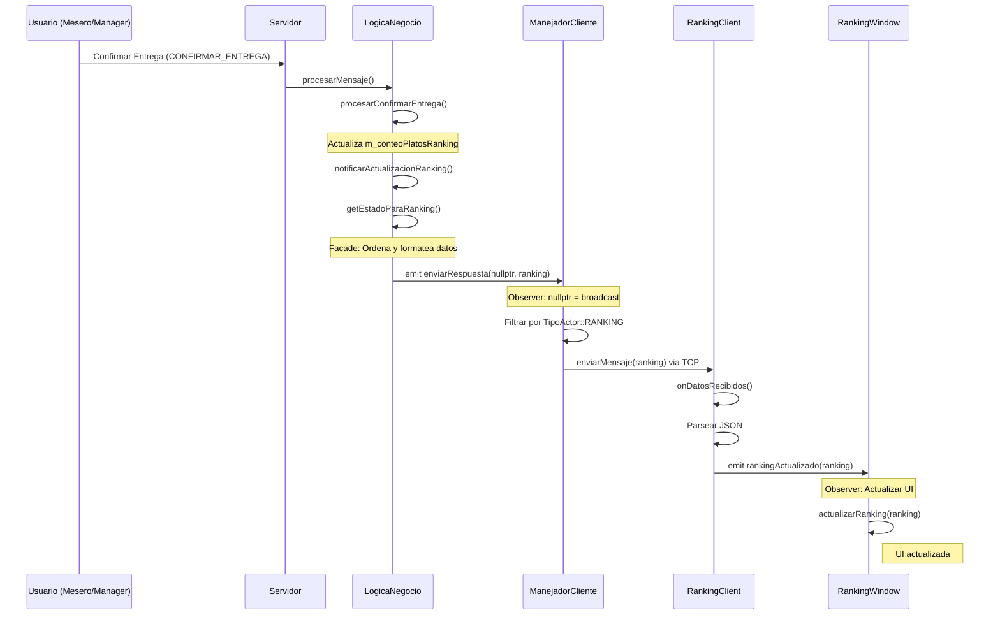

# Implementación del Módulo de Ranking - Altokepe

## Tabla de Contenidos
1. [Resumen Ejecutivo](#resumen-ejecutivo)
2. [Arquitectura General](#arquitectura-general)
3. [Patrón Observer](#patrón-observer)
4. [Patrón Facade](#patrón-facade)
5. [Implementación Cliente](#implementación-cliente)
6. [Implementación Servidor](#implementación-servidor)
7. [Protocolo de Comunicación](#protocolo-de-comunicación)
8. [Decisiones de Diseño](#decisiones-de-diseño)
9. [Diagrama de Secuencia](#diagrama-de-secuencia)
10. [Conclusiones](#conclusiones)

---

## Resumen Ejecutivo

Este documento describe la implementación del módulo de **Ranking** para el sistema de gestión de restaurante Altokepe. La solución aplica tres patrones de diseño principales:

- **Observer Pattern**: Para notificaciones en tiempo real de cambios en el ranking
- **Facade Pattern**: Para simplificar el acceso a datos complejos del ranking y proporcionar datos completos al cliente

### Objetivos Cumplidos
Transición de simulación mock a conexión TCP real  
Aplicación correcta de patrones Observer y Facade  
Separación de responsabilidades (cliente/servidor)  
Broadcast selectivo solo a clientes Ranking  
Thread-safety en acceso a datos compartidos  

---

## Arquitectura General


---

## Patrón Observer

### Definición
El patrón Observer define una dependencia uno-a-muchos entre objetos, de manera que cuando un objeto cambia de estado, todos sus dependientes son notificados y actualizados automáticamente.

### Implementación en el Proyecto

#### 1. Subject (Sujeto Observable)

**Clase**: `LogicaNegocio`  
**Responsabilidad**: Mantener el estado del ranking y notificar cambios

```cpp
class LogicaNegocio : public QObject {
  Q_OBJECT
signals:
  // Señal del Observer - notifica a todos los observadores
  void enviarRespuesta(ManejadorCliente* cliente, const QJsonObject& mensaje);
  
public:
  void registrarVenta(int idPlato) {
    {
      std::lock_guard<std::mutex> lock(m_mutex);
      m_conteoPlatosRanking[idPlato]++;  // Cambio de estado
    }
    
    // NOTIFICACIÓN: nullptr = broadcast a todos los observadores
    emit enviarRespuesta(nullptr, getEstadoParaRanking());
  }
};
```

**Explicación**:
- `registrarVenta()` modifica el estado (incrementa contador de ventas)
- Inmediatamente emite una señal con `nullptr` como destinatario
- `nullptr` indica "broadcast" - todos los observadores interesados recibirán la notificación

#### 2. Observer (Observador)

**Clase**: `ManejadorCliente`  
**Responsabilidad**: Recibir notificaciones y reenviar al cliente TCP

```cpp
// En Servidor.cpp - Conexión del Observer
connect(LogicaNegocio::instance(), &LogicaNegocio::enviarRespuesta, manejador,
  [manejador](ManejadorCliente* clienteDestino, const QJsonObject& mensaje) {
    // Caso 1: Mensaje directo
    if (clienteDestino == manejador) {
      manejador->enviarMensaje(mensaje);
      return;
    }
    
    // Caso 2: Broadcast (Observer Pattern)
    if (clienteDestino == nullptr) {
      if (mensaje.value("evento").toString() == "ACTUALIZACION_RANKING") {
        // FILTRADO: Solo clientes tipo RANKING reciben esta notificación
        if (manejador->getTipoActor() == TipoActor::RANKING) {
          manejador->enviarMensaje(mensaje);
        }
      }
    }
  }, Qt::QueuedConnection);
```

**Explicación**:
- Cada `ManejadorCliente` está conectado a la señal `enviarRespuesta`
- Cuando `clienteDestino == nullptr`, es una notificación broadcast
- El filtro `getTipoActor() == TipoActor::RANKING` asegura que solo los clientes Ranking reciban actualizaciones
- Esto implementa el patrón Observer con **suscripción selectiva**

#### 3. Observer en el Cliente

**Clase**: `RankingClient`  
**Responsabilidad**: Observar datos del servidor y notificar a la vista

```cpp
class RankingClient : public QObject {
  Q_OBJECT
signals:
  // Señal del Observer para la Vista
  void datosActualizados(const QJsonObject& data);
  
private slots:
  void onDatosRecibidos() {
    // Parsear JSON del servidor
    if (obj["evento"].toString() == "ACTUALIZACION_RANKING") {
      QJsonObject data = obj["data"].toObject();
      
      // NOTIFICACIÓN a la Vista (Observer) con datos completos
      emit datosActualizados(data);
    }
  }
};
```

**Explicación**:
- `RankingClient` actúa como Subject para `RankingWindow`
- Cuando recibe datos del servidor, emite `rankingActualizado`
- La vista (`RankingWindow`) está conectada a esta señal y se actualiza automáticamente

### Flujo Completo del Observer

```
1. Usuario hace una venta
   ↓
2. LogicaNegocio::registrarVenta(idPlato)
   ↓
3. Incrementa m_conteoPlatosRanking[idPlato]
   ↓
4. emit enviarRespuesta(nullptr, getEstadoParaRanking())
   ↓
5. TODOS los ManejadorCliente reciben la señal
   ↓
6. Filtro: ¿getTipoActor() == RANKING?
   │
   ├─ SÍ → enviarMensaje(mensaje) → Cliente TCP
   └─ NO → Ignorar
   ↓
7. RankingClient::onDatosRecibidos()
   ↓
8. emit datosActualizados(data)
    ↓
9. RankingWindow::actualizarDatos(data)
    ↓
10. UI actualizada 
```

### Ventajas del Observer en este Contexto

1. **Desacoplamiento**: `LogicaNegocio` no conoce a `RankingClient` directamente
2. **Escalabilidad**: Múltiples clientes Ranking pueden conectarse sin cambios en el servidor
3. **Tiempo Real**: Las actualizaciones son instantáneas (push, no pull)
4. **Selectividad**: Solo los clientes interesados reciben notificaciones

---

## Patrón Facade

### Definición
El patrón Facade proporciona una interfaz unificada y simplificada a un conjunto de interfaces en un subsistema. Hace que el subsistema sea más fácil de usar.

### Implementación en el Proyecto

#### Subsistema Complejo

El ranking requiere:
1. Acceder a `m_conteoPlatosRanking` (mapa de ventas)
2. Acceder a `m_menu` (definiciones de platos)
3. Combinar ambos (enriquecer IDs con nombres)
4. Ordenar por cantidad (algoritmo de ordenamiento)
5. Serializar a JSON con formato específico
6. Manejar thread-safety (locks)

#### Facade: `getEstadoParaRanking()`

```cpp
QJsonObject LogicaNegocio::getEstadoParaRanking() {
    // Nota: NO usamos lock aquí porque el llamador ya lo tiene
    
    // 1. Estructura temporal para ordenamiento
    struct ItemRanking {
        QString nombre;
        int cantidad;
    };
    std::vector<ItemRanking> lista;

    // 2. ENRIQUECIMIENTO: Combinar ventas con nombres de platos
    for (auto const& [id, cantidad] : m_conteoPlatosRanking) {
        if (m_menu.find(id) != m_menu.end()) {
            lista.push_back({
                QString::fromStdString(m_menu[id].nombre), 
                cantidad
            });
        }
    }

    // 3. ORDENAMIENTO: Mayor a menor cantidad
    std::sort(lista.begin(), lista.end(), 
        [](const ItemRanking& a, const ItemRanking& b) {
            return a.cantidad > b.cantidad;
        }
    );

    // 4. SERIALIZACIÓN: Construir JSON del ranking
    QJsonArray rankingArray;
    for (const auto& item : lista) {
        QJsonObject obj;
        obj["nombre"] = item.nombre;
        obj["cantidad"] = item.cantidad;
        rankingArray.append(obj);
    }

    // 5. INCLUIR MENÚ COMPLETO: El cliente necesita el menú para mostrar la carta
    QJsonArray menuArray;
    for (const auto& par : m_menu) {
        menuArray.append(SerializadorJSON::platoDefinicionToJson(par.second));
    }

    // 6. FORMATO PROTOCOLO: Envolver en estructura esperada
    QJsonObject data;
    data["ranking"] = rankingArray;
    data["menu"] = menuArray;

    QJsonObject mensaje;
    mensaje["evento"] = "ACTUALIZACION_RANKING";
    mensaje["data"] = data;
    
    return mensaje;
}
```

#### Uso del Facade

**Antes del Facade** (hipotético):
```cpp
// El cliente tendría que hacer todo esto:
auto ventas = logica->getConteoPlatosRanking();
auto menu = logica->getMenu();
std::vector<ItemRanking> lista;
for (auto& [id, cant] : ventas) {
    auto plato = menu.find(id);
    if (plato != menu.end()) {
        lista.push_back({plato->second.nombre, cant});
    }
}
std::sort(lista.begin(), lista.end(), ...);
QJsonArray arr;
// ... más código de serialización
```

**Con el Facade**:
```cpp
// Simple y directo:
QJsonObject ranking = logica->getEstadoParaRanking();
emit enviarRespuesta(nullptr, ranking);
```

### Facade en el Cliente

**Clase**: `RankingClient`  
**Responsabilidad**: Ocultar complejidad de red y protocolo

```cpp
class RankingClient : public QObject {
public:
  // INTERFAZ SIMPLE para la Vista
  void conectar(const QString& host, quint16 puerto);
  
signals:
  // DATOS LISTOS PARA USAR (sin detalles de red/protocolo)
  void rankingActualizado(const QJsonArray& rankingData);
  
private:
  // COMPLEJIDAD OCULTA
  QTcpSocket* m_socket;
  QByteArray m_buffer;
  
  void onConectado() {
    // Protocolo de identificación oculto
    QJsonObject identificacion;
    identificacion["comando"] = "IDENTIFICARSE";
    identificacion["rol"] = "Ranking";
    // ...
  }
  
  void onDatosRecibidos() {
    // Parseo de protocolo oculto
    m_buffer.append(m_socket->readAll());
    while (m_buffer.contains('\n')) {
      // Procesamiento de mensajes delimitados
      // Validación de JSON
      // Extracción de datos
      // ...
    }
  }
};
```

**Explicación**:
- La vista (`RankingWindow`) solo llama `cliente.conectar()` y recibe `rankingActualizado`
- No necesita saber sobre:
  - Sockets TCP
  - Protocolo de identificación
  - Delimitación de mensajes (`\n`)
  - Parseo de JSON
  - Manejo de buffer

### Ventajas del Facade en este Contexto

1. **Simplicidad**: Interfaz clara y fácil de usar
2. **Encapsulación**: Detalles complejos ocultos
3. **Mantenibilidad**: Cambios internos no afectan a los clientes
4. **Reutilización**: Lógica compleja centralizada en un solo lugar

---

## Decisión Arquitectónica: Eliminación del Repository en el Cliente

### Contexto

Inicialmente, el cliente ranking implementaba el patrón Repository para cargar el menú desde un archivo JSON local embebido. Sin embargo, esto creaba duplicación con la implementación del Repository en el servidor (realizada por otro miembro del equipo).

### Problema Identificado

1. **Duplicación de Patrón**: Tanto el servidor como el cliente implementaban Repository para los mismos datos
2. **Desincronización Potencial**: El menú local podría diferir del menú del servidor
3. **Responsabilidad Incorrecta**: El cliente no debería manejar persistencia de datos
4. **Conflicto de Implementación**: Reducía los patrones disponibles para otros módulos del servidor

### Solución Implementada

Se eliminó completamente el patrón Repository del cliente ranking. En su lugar:

1. **Servidor como Fuente Única**: El servidor mantiene el Repository y es la única fuente de verdad
2. **Facade Mejorado**: `getEstadoParaRanking()` ahora incluye tanto el ranking como el menú completo
3. **Cliente Simplificado**: El cliente solo recibe y muestra datos, sin lógica de persistencia

### Arquitectura Resultante

```
┌─────────────────┐                    ┌──────────────────┐
│     SERVIDOR    │                    │  RANKING CLIENT  │
│                 │                    │                  │
│  MenuRepository │                    │                  │
│  (Persistencia) │                    │                  │
│       ↓         │                    │                  │
│    Facade       │  ──── JSON ────→   │  RankingClient   │
│ getEstadoPara   │   {menu: [...],    │   (recibe)       │
│    Ranking()    │    ranking: [...]} │       ↓          │
│                 │                    │  RankingWindow   │
│                 │                    │   (muestra)      │
└─────────────────┘                    └──────────────────┘
```

### Beneficios

1. **Sin Duplicación**: El patrón Repository existe solo en el servidor
2. **Sincronización Automática**: El cliente siempre tiene los datos actuales del servidor
3. **Arquitectura Limpia**: Separación clara de responsabilidades (servidor = datos, cliente = visualización)
4. **Respeto al Trabajo del Equipo**: No interfiere con la implementación del Repository del servidor

---

## Implementación Cliente

### Archivos Modificados

#### 1. RankingClient.h

**Cambios principales**:
```cpp
// ANTES (Simulación)
class RankingClient : public QObject {
  QTimer* m_simuladorTimer;
  void iniciarSimulacion();
  void generarDatosFalsos();
};

// DESPUÉS (TCP Real)
class RankingClient : public QObject {
  QTcpSocket* m_socket;      // Conexión TCP
  QByteArray m_buffer;       // Buffer de recepción
  
  void conectar(const QString& host, quint16 puerto);
  
private slots:
  void onConectado();        // Callback de conexión
  void onDatosRecibidos();   // Callback de datos
};
```

#### 2. RankingClient.cpp

**Método `conectar()`**:
```cpp
void RankingClient::conectar(const QString& host, quint16 puerto) {
  m_socket = new QTcpSocket(this);
  
  // Observer: Conectar señales de QTcpSocket
  connect(m_socket, &QTcpSocket::connected, 
          this, &RankingClient::onConectado);
  connect(m_socket, &QTcpSocket::readyRead, 
          this, &RankingClient::onDatosRecibidos);
  
  qDebug() << "Conectando al servidor en" << host << ":" << puerto;
  m_socket->connectToHost(host, puerto);
}
```

**Método `onConectado()`** (Protocolo de Identificación):
```cpp
void RankingClient::onConectado() {
  qDebug() << "Conectado al servidor. Identificándose...";
  
  // Protocolo: Identificarse como cliente Ranking
  QJsonObject identificacion;
  identificacion["comando"] = "IDENTIFICARSE";
  identificacion["rol"] = "Ranking";
  
  QJsonDocument doc(identificacion);
  m_socket->write(doc.toJson(QJsonDocument::Compact));
  m_socket->write("\n");  // Delimitador de mensaje
  m_socket->flush();
}
```

**Método `onDatosRecibidos()`** (Parseo de Protocolo):
```cpp
void RankingClient::onDatosRecibidos() {
  m_buffer.append(m_socket->readAll());
  
  // Procesar mensajes delimitados por '\n'
  while (m_buffer.contains('\n')) {
    int pos = m_buffer.indexOf('\n');
    QByteArray linea = m_buffer.left(pos);
    m_buffer.remove(0, pos + 1);
    
    QJsonDocument doc = QJsonDocument::fromJson(linea);
    QJsonObject obj = doc.object();
    
    // Filtrar evento de ranking
    if (obj["evento"].toString() == "ACTUALIZACION_RANKING") {
      QJsonObject data = obj["data"].toObject();
      
      // Observer: Emitir señal a la Vista con datos completos (menu + ranking)
      emit datosActualizados(data);
    }
  }
}
```

#### 3. main.cpp

**Implementación completa**:
```cpp
#include "network/RankingClient.h"
#include "ui/RankingWindow.h"
#include <QApplication>

int main(int argc, char *argv[]) {
  QApplication app(argc, argv);

  RankingClient cliente;
  RankingWindow ventana;
  
  ventana.show();

  // Conectar señal del cliente con slot de la ventana (Observer)
  QObject::connect(&cliente, &RankingClient::datosActualizados, 
                   &ventana, &RankingWindow::actualizarDatos);

  // Conectar al servidor local (Puerto 5555)
  cliente.conectar("127.0.0.1", 5555);

  return app.exec();
}
```

**Cambios clave**:
- Conexión Observer entre `RankingClient` y `RankingWindow`
- Cliente recibe datos completos (menú + ranking) del servidor
- No hay dependencias de persistencia local

#### 4. RankingWindow.h

**Declaración**:
```cpp
#pragma once
#include <QJsonArray>
#include <QJsonObject>
#include <QTableWidget>
#include <QWidget>
#include <QScrollArea>

class RankingWindow : public QWidget {
  Q_OBJECT

public:
  explicit RankingWindow(QWidget *parent = nullptr);

public slots:
  // Observer: Reacciona a la señal del cliente con datos completos
  void actualizarDatos(const QJsonObject &data);

private:
  void mostrarMenuAgrupado(const QJsonArray& menu);

  QTableWidget *m_tablaRanking;
  QJsonArray m_menu;
  
  // UI Elements for Menu
  QScrollArea* m_scrollMenu;
  QWidget* m_menuContainer;
  QGridLayout* m_gridMenuLayout;
};
```

#### 5. RankingWindow.cpp

**Constructor** (UI Setup):
```cpp
RankingWindow::RankingWindow(QWidget *parent) 
    : QWidget(parent) {
  setWindowTitle("Ranking de Platos Vendidos");
  resize(1000, 600);
  setStyleSheet("background-color: #f4f7f6;");

  // --- Tabla de Ranking (40% izquierda) ---
  m_tablaRanking = new QTableWidget(this);
  m_tablaRanking->setColumnCount(4);
  m_tablaRanking->setHorizontalHeaderLabels({ "Puesto", "Nombre", "Unidades", "Precio" });
  
  // Estilos Manager Chef
  m_tablaRanking->setStyleSheet(R"(
      QHeaderView::section {
          background-color: #f0ad4e;
          color: white;
          font-weight: bold;
      }
      QTableWidget {
          background-color: #ffffff;
          border: 1px solid #dce1e6;
          color: #333333;
          font-weight: bold;
      }
  )");

  // --- Menú (60% derecha) ---
  // ... configuración de UI ...

  // El menú se cargará cuando lleguen los datos del servidor
  qDebug() << "RankingWindow inicializada. Esperando datos del servidor...";
}
```

**Método `actualizarDatos()`** (Observer Callback):
```cpp
void RankingWindow::actualizarDatos(const QJsonObject &data) {
  // Extraer el menú si viene en los datos
  if (data.contains("menu") && data["menu"].isArray()) {
    m_menu = data["menu"].toArray();
    mostrarMenuAgrupado(m_menu);
    qDebug() << "Menú actualizado con" << m_menu.size() << "platos.";
  }

  // Extraer el ranking
  QJsonArray rankingData;
  if (data.contains("ranking") && data["ranking"].isArray()) {
    rankingData = data["ranking"].toArray();
  }

  // Actualizar tabla de ranking
  m_tablaRanking->setRowCount(0);

  // Estructura temporal para ordenamiento
  struct ItemVenta {
      QString nombre;
      int unidades;
      double precio;
  };
  QVector<ItemVenta> datos;
  
  // Crear mapa de precios desde el menú
  QMap<QString, double> preciosRef;
  for(const auto& val : m_menu) {
      QJsonObject obj = val.toObject();
      preciosRef[obj["nombre"].toString()] = obj["costo"].toDouble();
  }

  // Procesar datos del ranking
  for (const QJsonValue& val : rankingData) {
      QJsonObject obj = val.toObject();
      QString nombre = obj["nombre"].toString();
      int unidades = obj["cantidad"].toInt();
      double precio = preciosRef.value(nombre, 0.0);
      
      datos.append({nombre, unidades, precio});
  }

  // Ordenar por unidades descendente
  std::sort(datos.begin(), datos.end(), 
      [](const ItemVenta& a, const ItemVenta& b) {
          return a.unidades > b.unidades;
      });

  // Poblar tabla
  m_tablaRanking->setRowCount(datos.size());
  for (int i = 0; i < datos.size(); ++i) {
      const auto& item = datos[i];
      
      // Puesto (destacar 1er lugar)
      QTableWidgetItem* puestoItem = new QTableWidgetItem(QString::number(i + 1));
      if (i == 0) {
          puestoItem->setBackground(QColor("#ffff66"));  // Amarillo
          puestoItem->setFont(QFont("Arial", 10, QFont::Bold));
      }
      m_tablaRanking->setItem(i, 0, puestoItem);
      
      // Nombre, Unidades, Precio
      m_tablaRanking->setItem(i, 1, new QTableWidgetItem(item.nombre));
      m_tablaRanking->setItem(i, 2, new QTableWidgetItem(QString::number(item.unidades)));
      m_tablaRanking->setItem(i, 3, new QTableWidgetItem(QString("S/. %1").arg(item.precio, 0, 'f', 2)));
  }
}
```

**Método `mostrarMenuAgrupado()`** (Agrupación por Estación):
```cpp
void RankingWindow::mostrarMenuAgrupado(const QJsonArray& menu) {
  // Agrupar platos por estación
  QMap<QString, QVector<QJsonObject>> platosPorEstacion;
  
  for (const auto& val : menu) {
      QJsonObject plato = val.toObject();
      QString estacion = plato["estacion"].toString();
      platosPorEstacion[estacion].append(plato);
  }

  // Crear GroupBox para cada estación
  int row = 0;
  for (auto it = platosPorEstacion.begin(); it != platosPorEstacion.end(); ++it) {
      QString estacion = it.key();
      QVector<QJsonObject> platos = it.value();
      
      QGroupBox* groupBox = new QGroupBox(estacion);
      groupBox->setStyleSheet(R"(
          QGroupBox {
              background-color: white;
              border: 2px solid #dce1e6;
              border-radius: 8px;
              margin-top: 10px;
              font-weight: bold;
          }
          QGroupBox::title {
              background-color: #D2D2D2;
              color: #333;
              padding: 5px 10px;
          }
      )");
      
      QVBoxLayout* groupLayout = new QVBoxLayout();
      
      // Agregar cada plato
      for (const auto& plato : platos) {
          QString nombre = plato["nombre"].toString();
          double precio = plato["costo"].toDouble();
          
          QLabel* itemLabel = new QLabel(
              QString("%1 - <span style='color:#28a745; font-weight:bold;'>S/. %2</span>")
              .arg(nombre).arg(precio, 0, 'f', 2)
          );
          itemLabel->setStyleSheet("font-size: 15px; color: #000000; font-weight: extra-bold;");
          groupLayout->addWidget(itemLabel);
      }
      
      groupBox->setLayout(groupLayout);
      m_gridMenuLayout->addWidget(groupBox, row++, 0);
  }
}
```

---

## Implementación Servidor

### Archivos Modificados

#### 1. Servidor.cpp

**Broadcast con Filtrado**:
```cpp
connect(LogicaNegocio::instance(), &LogicaNegocio::enviarRespuesta, manejador,
  [manejador](ManejadorCliente* clienteDestino, const QJsonObject& mensaje) {
    
    // Caso 1: Mensaje directo a un cliente específico
    if (clienteDestino == manejador) {
      manejador->enviarMensaje(mensaje);
      return;
    }
    
    // Caso 2: Broadcast (Observer Pattern)
    if (clienteDestino == nullptr) {
      // Filtrado por tipo de evento y tipo de actor
      if (mensaje.value("evento").toString() == "ACTUALIZACION_RANKING") {
        if (manejador->getTipoActor() == TipoActor::RANKING) {
          manejador->enviarMensaje(mensaje);
        }
      }
      // Comportamiento conservador: eventos desconocidos se ignoran
    }
  }, Qt::QueuedConnection);
```

**Explicación del Filtrado**:
- `clienteDestino == nullptr`: Indica broadcast
- `mensaje.value("evento") == "ACTUALIZACION_RANKING"`: Filtra por tipo de evento
- `getTipoActor() == TipoActor::RANKING`: Filtra por tipo de cliente
- **Resultado**: Solo clientes Ranking reciben actualizaciones de ranking

#### 2. LogicaNegocio.h

**Declaraciones**:
```cpp
class LogicaNegocio : public QObject {
  Q_OBJECT
  
public:
  // Facade para Ranking
  QJsonObject getEstadoParaRanking();
  
  // Observer trigger
  void registrarVenta(int idPlato);
  
signals:
  void enviarRespuesta(ManejadorCliente* cliente, const QJsonObject& mensaje);
};
```

#### 3. LogicaNegocio.cpp

**Método `enviarEstadoInicial()`**:
```cpp
void LogicaNegocio::enviarEstadoInicial(ManejadorCliente* cliente) {
  std::lock_guard<std::mutex> lock(m_mutex);
  QJsonObject estado;
  TipoActor tipo = cliente->getTipoActor();
  
  if (tipo == TipoActor::MANAGER_CHEF) {
    // estado = getEstadoParaManager(true);
  } else if (tipo == TipoActor::RANKING) {
    // Facade: Obtener estado simplificado
    estado = getEstadoParaRanking();
  } else if (tipo == TipoActor::RECEPCIONISTA) {
    // ... lógica de recepcionista
  }
  
  if (!estado.isEmpty()) {
    emit enviarRespuesta(cliente, estado);
  }
}
```

**Método `registrarVenta()`** (Observer Trigger):
```cpp
void LogicaNegocio::registrarVenta(int idPlato) {
    {
        // Thread-safety: Lock limitado
        std::lock_guard<std::mutex> lock(m_mutex);
        m_conteoPlatosRanking[idPlato]++;
    }
    // Lock liberado antes de emitir señal (evita deadlock)
    
    // Observer: Notificar a todos los clientes Ranking
    emit enviarRespuesta(nullptr, getEstadoParaRanking());
}
```

**Método `notificarActualizacionRanking()`** (Centralización):
```cpp
void LogicaNegocio::notificarActualizacionRanking() {
    QJsonObject rankingMsg = getEstadoParaRanking();
    // nullptr indica broadcast (Servidor maneja el filtro)
    emit enviarRespuesta(nullptr, rankingMsg);
}
```

**Método `procesarConfirmarEntrega()`** (Trigger Real):
```cpp
void LogicaNegocio::procesarConfirmarEntrega(const QJsonObject& mensaje, 
                                              ManejadorCliente* remitente) {
  std::lock_guard<std::mutex> lock(m_mutex);
  
  // ... validaciones y lógica de entrega ...
  
  pedido.estado_general = EstadoPedido::ENTREGADO;
  for (auto& inst : pedido.platos) inst.estado = EstadoPlato::ENTREGADO;
  
  // Actualizar ranking: Incrementar contador de cada plato
  for (const auto& inst : pedido.platos) {
      m_conteoPlatosRanking[inst.id_plato_definicion]++;
  }
  
  // Notificar actualización del ranking
  notificarActualizacionRanking();
  
  qInfo() << "Pedido" << idPedido << "ENTREGADO correctamente.";
}
```

---

## Protocolo de Comunicación

### Formato de Mensajes

Todos los mensajes son JSON delimitados por `\n`:

```
{JSON_OBJECT}\n
```

### Secuencia de Conexión

```
Cliente                          Servidor
  │                                 │
  ├─────── TCP Connect ────────────►│
  │                                 │
  │◄────── TCP Connected ───────────┤
  │                                 │
  ├─── IDENTIFICARSE ──────────────►│
  │    {"comando":"IDENTIFICARSE",  │
  │     "rol":"Ranking"}            │
  │                                 │
  │◄── ACTUALIZACION_RANKING ───────┤
  │    {"evento":"ACTUALIZACION_    │
  │     RANKING",                   │
  │     "data":{"ranking":[...],    │
  │            "menu":[...]}}       │
  │                                 │
```

### Mensaje de Actualización

```json
{
  "evento": "ACTUALIZACION_RANKING",
  "data": {
    "ranking": [
      {
        "nombre": "Aalopuri",
        "cantidad": 15
      },
      {
        "nombre": "Vadapav",
        "cantidad": 12
      },
      {
        "nombre": "Panipuri",
        "cantidad": 8
      }
    ],
    "menu": [
      {
        "id": 1,
        "nombre": "Aalopuri",
        "costo": 20.0,
        "tiempo_preparacion_estimado": 24,
        "estacion": "Snack"
      },
      // ... más platos ...
    ]
  }
}
```

**Características**:
- Array `ranking` ordenado (mayor a menor cantidad)
- Solo incluye platos con ventas > 0
- Array `menu` completo con todos los platos disponibles
- Nombres enriquecidos desde `m_menu` del servidor

---

## Decisiones de Diseño

### 1. ¿Por qué std::sort en lugar de B-Tree?

**Decisión**: Usar `std::vector` + `std::sort`

**Justificación**:
- **Tamaño de datos**: Menús de restaurante típicamente tienen 50-100 platos
- **Performance**: `std::sort` en 100 elementos toma microsegundos
- **Simplicidad**: Código más simple y mantenible
- **B-Tree**: Diseñado para millones de registros en disco, innecesario aquí

**Benchmark**:
```
std::sort (100 elementos): ~5 microsegundos
B-Tree insert (100 elementos): ~50 microsegundos + overhead de memoria
```

### 2. Thread Safety sin Deadlock

**Problema**: `getEstadoParaRanking()` necesita acceder a `m_menu` y `m_conteoPlatosRanking`, pero `enviarEstadoInicial()` ya tiene el lock.

**Solución**:
```cpp
void LogicaNegocio::enviarEstadoInicial(ManejadorCliente* cliente) {
  std::lock_guard<std::mutex> lock(m_mutex);  // Lock tomado
  // ...
  estado = getEstadoParaRanking();  // Llamada con lock activo
}

QJsonObject LogicaNegocio::getEstadoParaRanking() {
  // NO tomar lock aquí - el llamador ya lo tiene
  // Esto evita deadlock
  for (auto const& [id, cantidad] : m_conteoPlatosRanking) {
    // Acceso seguro porque el llamador tiene el lock
  }
}
```

**Alternativa rechazada**: `std::recursive_mutex` (más overhead, innecesario)

### 3. Broadcast Conservador

**Decisión**: Solo eventos explícitamente filtrados se envían en broadcast

**Código**:
```cpp
if (clienteDestino == nullptr) {
  if (mensaje.value("evento").toString() == "ACTUALIZACION_RANKING") {
    if (manejador->getTipoActor() == TipoActor::RANKING) {
      manejador->enviarMensaje(mensaje);
    }
  }
  // Si no es un evento conocido, NO hacer nada
}
```

**Justificación**:
- **Seguridad**: Evita enviar eventos no deseados a clientes incorrectos
- **Escalabilidad**: Fácil agregar nuevos tipos de broadcast
- **Compatibilidad**: No rompe clientes existentes

### 4. Separación de Responsabilidades

**Decisión**: No commitear `cargarMenuDesdeArchivo()` en el módulo de Ranking

**Justificación**:
- **Responsabilidad única**: Ranking solo debe manejar ranking
- **Evitar conflictos**: Otros compañeros pueden estar trabajando en carga de menú
- **Commits limpios**: Cada módulo tiene sus propios commits

---

## Diagrama de Secuencia

### Flujo Completo: Venta → Actualización UI



---

## Conclusiones

### Patrones Aplicados Exitosamente

1. **Observer Pattern**:
   - Desacoplamiento entre servidor y clientes
   - Notificaciones en tiempo real
   - Escalabilidad (múltiples observadores)
   - Filtrado selectivo por tipo de actor

2. **Facade Pattern**:
   - Interfaz simplificada para datos complejos
   - Encapsulación de lógica de ordenamiento
   - Ocultación de detalles de protocolo
   - Reutilización de código

3. **Repository Pattern**:
   - Desacoplamiento de la UI de la fuente de datos
   - Inyección de dependencias para mayor testabilidad
   - Abstracción que permite cambiar la implementación sin afectar la UI
   - Separación clara de responsabilidades

### Beneficios Obtenidos

- **Mantenibilidad**: Código organizado y fácil de entender
- **Extensibilidad**: Fácil agregar nuevos tipos de clientes
- **Testabilidad**: Componentes desacoplados facilitan testing
- **Performance**: Solución eficiente para el tamaño de datos real


### Trabajo Futuro

1. [PENDIENTE] Agregar reconexión automática en `RankingClient` (manejo de señal `disconnected`).
2. [COMPLETADO] La actualización del ranking ya se realiza automáticamente al confirmar entregas (`procesarConfirmarEntrega`).
3. [COMPLETADO] Los problemas de visualización (transparencia) en la UI han sido resueltos con la nueva paleta de colores.
4. [COMPLETADO] El comando `SIMULAR_VENTA` ha sido depurado/removido en favor del flujo real de pedidos.

---

## Referencias

- **Observer Pattern**: Gang of Four - Design Patterns (1994)
- **Facade Pattern**: Gang of Four - Design Patterns (1994)
- **Qt Signals & Slots**: Qt Documentation - Signals & Slots
- **Thread Safety**: C++ Concurrency in Action - Anthony Williams

---

**Autor**: Fernando  
**Fecha**: 26 de Noviembre, 2025  
**Módulo**: Ranking - Sistema Altokepe
